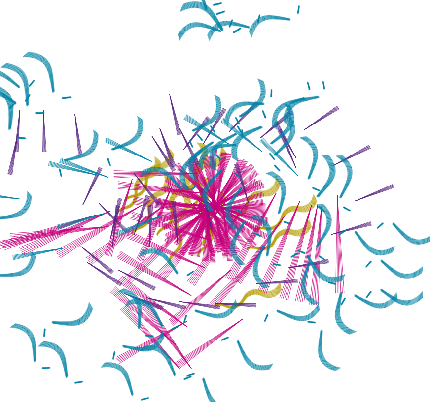

# Evidencias de la unidad 5

## Actividad 01
### Repasa el caso de estudio
En esta actividad vas a poner a funcionar el caso de estudio de la unidad anterior y lo vas a repasar de nuevo. Mira, es muy importante que le dedique un tiempo generoso a revisar de nuevo el caso de estudio, ya que es un ejemplo muy completo y te va a ayudar a entender mejor el resto de la unidad.

> De una 🫡

#### Describe cómo se están comunicando el micro:bit y el sketch de p5.js. ¿Qué datos envía el micro:bit?
La comunicación del *micro:bit* y el sketch de *p5.js* se da a través del puerto serial. El *micro:bit* envía 4 valores (`xValue`, `yValue`, `aState`, `bState`), que son las coordenadas en X y Y según su acelerómetro en forma de `floats`, y el estado de los 2 botones `A` y `B` en booleanos. Además, envía un caracter `\n`, para disiinguir entre cada "tanda" de valores.  
#### ¿Cómo es la estructura del protocolo ASCII usado?
El mensaje tiene los 4 valores en este orden: `xValue`, `yValue`, `aState`, `bState`. Estos están separados por comas `,` y sin espacios. Además, al final de cada "tanda", se envía un `\n`, referencia que usa *p5.js* para terminar de leer un "bloque" específico de datos. 
#### Muestra y explica la parte del código de p5.js donde lee los datos del micro:bit y los transforma en coordenadas de la pantalla.
La parte específica encargada de leer los datos se encuentra dentro de la función `draw()`:
```js
if (port.availableBytes() > 0) {
  let data = port.readUntil("\n");                     // (1)
  if (data) {
    data = data.trim();                                // (2)
    let values = data.split(",");                      // (3)
    if (values.length == 4) {
      microBitX = int(values[0]) + windowWidth / 2;    // (4)
      microBitY = int(values[1]) + windowHeight / 2;   // (4)
      microBitAState = values[2].toLowerCase() === "true";
      microBitBState = values[3].toLowerCase() === "true";
      updateButtonStates(microBitAState, microBitBState);
    } else {
      print("No se están recibiendo 4 datos del micro:bit");
    }
  }
}
```
1. Lee la información recibida por el puerto serial hasta encontrar un `\n` y lo almacena en un string `data`.
2. Borra los espacios (y otros caracteres considerados *whitespace*) de `data`.
3. Separa `data` en strings individuales por las comas `,` y los almacena en el array `values`.
4. Toma el valor dado por el *micro:bit* de su X y Y y los suma a `windowWidth / 2` y `windowHeight / 2` respectivamente, para que el 0, 0 del *micro:bit* sea el centro del canvas.
#### ¿Cómo se generan los eventos A pressed y B released que se generan en p5.js a partir de los datos que envía el micro:bit?
Se generan dentro de la función `updateButtonStates(newAState, newBState)`. En ambos casos se encarga de compara el estado anterior de A o B con el que se acaba de recibir, y luego almacena el estado actual para comparar en el próximo frame. Esta acción es un poco redundante para A, pues funciona al ser presionado (es directo y podría tomarse simplemente en valor enviado por el *micro:bit*), pero es absolutamente necesaria para que B pueda funcionar al ser soltado (se busca que el estado previo sea `True` y el nuevo sea `False`).
#### Capturas de pantalla de los algunos dibujos que hayas hecho con el sketch.



## Timeline de proceso de investigación (Actividad 01)
### Como no sé organizar nada, simplemente voy a ir poniendo acá entradas de las cositas que van pasando.
Bueno, so, lo primero fue buscar el caso de estudio pasado para poder usarlo (el link que el profe nos proporcionó simplemente lleva a *p5.js*). Habiendo encontrado el código y habiéndolo probado directamente en el [p5 del profe](https://editor.p5js.org/juanferfranco/sketches/6ovAtsZ10), tomé nota de cómo funciona con el *micro:bit*, y creé un [duplicado del proyecto](https://editor.p5js.org/MAG-02/sketches/Z7NIsRbFm) en caso de necesitar editarlo.

También aprendí 2 maneras diferentes de adjuntar archivos en GitHub desde navegador LOL

*Método al tomar una captura:*


*Método con subida de archivo:*


Explicando el funcionamiento del código, específicamente la lectura de datos por parte de *p5.js*, me di cuenta que había una (técnicamente 2) línea(s) específica(s) que no entendía:
```js
if (data) {
  data = data.trim();
}
```
Asumo que el `if (data)` simplemente verifica que sí se esté recibiendo algo. Creo que es una redundancia en nuestro caso porque sé que el código que tenemos funciona y los datos están siendo enviados correctamente. Aún así, intentaré ejecutar el código sin este `if` inicial para ver qué sucede.  
**Resultado:**  

El es similar a lo que esperaba: El código se ejecuta correctamente, y la funcionalidad no se ve afectada. Lo único es que, aparentemente, *p5.js* está un poco confundido y "deja perder" algunos datos, o quizá agrupa datos que no deberían ir juntos, por lo que muestra constantemente el error `No se están recibiendo 4 datos del micro:bit`. Quizá ese `if (data)` obliga a *p5.js* a procesar un poco más lento los datos y asegurarse de no perder información.  
Ahora sí, la duda real: **¿Qué hace `data.trim()`?** Ya que nosotros nunca leemos directamente el string, probar el efecto de esta línea requeriría múltiples prints durante la ejecución (cosa que es simple de hacer, la verdad), pero me dio pereza así que simplemente consulté las [referencias de *p5.js* sobre trim()](https://p5js.org/reference/p5/trim/). Resulta que la función se encarga de borrar espacios en blanco antes y después del contenido del string, sin tocar lo que está en el medio.

## Actividad 02
### Caso de estudio: micro:bit
Vamos a transformar el caso de estudio de la unidad anterior para que ahora la comunicación entre el micro:bit y p5.js se realice mediante un protocolo binario. Primero analizaremos el código del micro:bit y en la siguiente actividad veremos cómo leer los datos en p5.js.

Durante la lectura te indicaré los momentos en los que vale la pena detenerte para analizar 🧐, experimentar 🧪 y reportar ✍️ tus hallazgos en la bitácora de aprendizaje.

> Ah, y yo la actividad pasada escribiendo y experimentando a lo esquizofrénico JAJAJAJAJAJ

### Resultados de Experimentación:
Abre la aplicación, configura el puerto, deja los valores por defecto y presiona Conectar. Selecciona el puerto del micro:bit (mbed Serial port) y presiona Conectar. Luego, en la sección de Recepción de Datos, en Mostrar datos como, selecciona Texto.

#### 🧐🧪✍️ Captura el resultado del experimento anterior. ¿Por qué se ve este resultado?
Captura:  
Lo que se logra ver ahí es  
  
Ahora cambia la opción de Mostrar datos como a Todo en Hex y vuelve a capturar el resultado.
#### 🧐🧪✍️ Captura el resultado del experimento anterior. Lo que ves ¿Cómo está relacionado con esta línea de código?
```cpp
data = struct.pack('>2h2B', xValue, yValue, int(aState), int(bState))
```
**No te parece que el resultado es un poco más difícil de leer que el texto en ASCII?**

🧐🧪✍️ ¿Qué ventajas y desventajas ves en usar un formato binario en lugar de texto en ASCII?


