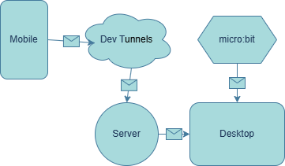

# Evidencias de la unidad 8

## Actividad 01
### 1. Documenta los referentes visuales que te inspiren.
Para la creación de visuales de música siempre he tenido en mente los visualizadores de barras, específicamente los "tradicionales" como [este](https://www.youtube.com/watch?v=-Yk7JLzsaqw), que parecen pequeños ladrillitos o barras más pequeñas y que van cambiando de color al subir.

También como referencia tengo en mente estos gráficos de barras que forman un círculo. No sé explicarlo más a detalle, así que mejor mostrar un [ejemplo](https://www.youtube.com/watch?v=avXQPMNIj-k).

Además de eso, también pienso en juegos de música como [este](https://www.youtube.com/watch?v=5mDjFdetU28), llamado *Super Hexagon*...

...o [este](https://www.youtube.com/watch?v=yznyQwCLnaM), llamado *Geometry Dash*.

Ambos juegos presentan gráficos frenéticos y muy coloridos, que reaccionan a los altos y bajos de la música e incluso, en cierta forma, a la interacción del jugador. Entiendo que ambos conceptos son bastante complejos de emular, pero definitivamente diría que esos son mis referentes e inspiraciones.

### 2. Define el concepto de las visuales que quieres crear.
Me interesaría mucho crear algo similar a un diagrama de barras pero en una forma hexagonal, pero realmente no tengo la menor idea de cómo hacerlo :\  
Creo que, por cuestiones de tiempo y pensando en mi habilidad, me limitaré a hacer una gráfica de barras, de pronto que sea también circular, pero que sea simple. La interacción que deseo permitiría rotar el diagrama desde el dispositivo móvil, y pausar/empezar la canción y menejar el volumen (y, por ende, el gráfico) desde el *micro:bit*.

### 3. Explica cómo el móvil y el micro:bit controlarán las visuales.
Desde el **móvil**:
* Tocar la pantalla (`touchStarted()`) "soltará" el gráfico para permitirle rotar. Es decir, si no se está tocando la pantalla, el gráfico va a desacelerar lentamente o frenar por completo (no he decidido, dependerá de qué logro crear).
* Por ende, dejar de tocar la pantalla (`touchEnded()`) aplicará esa desaceleración progresiva que mencioné. Si el usuario está tocando la pantalla, la desaceleración no entrará en efecto.
* Y, por último, mover el dedo sobre la pantalla (`touchMoved()`) añadirá una velocidad especificada en la dirección específica hacia donde mueva el dedo el usuario. Pienso que acá debo tener un threshold de la distancia mínima para contar el movimiento.

Desde el ***micro:bit***:
* Realizar un `shake` va a empezar o pausar la canción, lo que es una funcionalidad realmente fácil de implementar.
* Presionar el botón `A` disminuirá el volumen, y el botón `B` lo aumentará. Es una funcionalidad simple pero que presentará cambios inmediatos en el diagrama final.

### 4. Haz un boceto de todas las interfaces del sistema.
Bocetos hechos en Paint:

### 5. Haz un diagrama que explique cómo se comunicarán los diferentes componentes del sistema.

